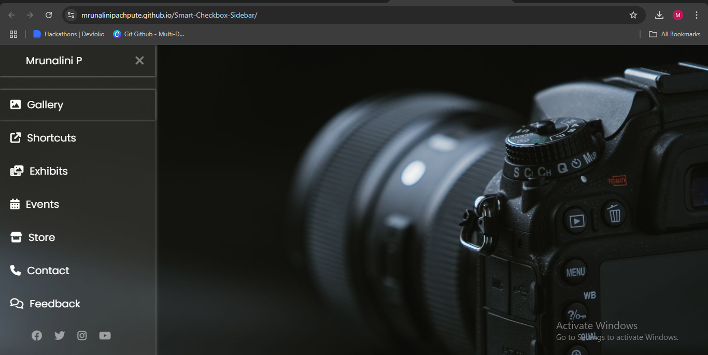

# 🌟 Pure CSS Collapsible Sidebar

A responsive sidebar menu built with **only HTML and CSS**, no JavaScript at all.

## 🔗 Live Preview

🌐 [View it on GitHub Pages](https://mrunalinipachpute.github.io/Smart-Checkbox-Sidebar/)

---
## 🎥 Screenshot

## 💡 Features

- 🎨 Stylish and responsive layout using Poppins font
- ✅ Clever use of a hidden checkbox with `:checked` to toggle sidebar
- ⚙️ Font Awesome icons and modern hover effects
- 🌐 Social media integration
- 📱 Mobile-friendly design

---

